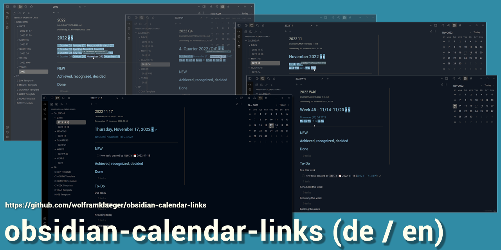

# obsidian-calendar-links
obsidian-calendar-links is a vault (folder) for the **note-taking app Obsidian (Obsidian.md)**, including all required plugins, settings, and templates.

Create a note for **each day, week, month, quarter, year**, that is automatically linked within your entire calendar.

Each such calendar-note includes a **to-do-list**, divided into

- due (today, this week, ... year)
- scheduled (...)
- recurring (...)
- Backlog
- Someday

Any task, that you set, anywhere in your vault, by using the standard Markdown-format

- [ ] description due-date done-date

is captured by these to-do-lists, and will reappear in the corresponding calendar notes and sections.  Moreover, all your to-do-lists are *automatically aggregated* from day, week, ... to year.

The task management functionality is provided by the Obsidian Community-Plugin [**Obsidian-Tasks**](https://github.com/obsidian-tasks-group/obsidian-tasks) .

## English (US) or German version
This is **obsidian-calendar-links**,  the *English (US)* version.

Es gibt auch eine [**deutsche Version** (obsidian-calendar-links-*DE*)](https://github.com/wolframklaeger/obsidian-calendar-links-de/)

Though, both versions can easily be translated and customized to any language or date format. 
 
## Required Obsidian-Plugins (pre-installed)
 
 - Calendar
 - Dataview
 - Periodic Notes
 - Tasks
 - Templater

## Additionally installed Plugins (not required)
 
 - Minimal Theme
 - Minimal Theme Settings
 - Recent Files

The *obsidian-calendar-links* vault is fine with any Obsidian-Theme.

*Minimal-Theme* is pre-installed, customized by the **included CSS Snippets**. Both is easily deinstalled and replaced by any other theme or snippets.
## Setup and launch
1. **[Code] > Download ZIP**
1. Download and unpack the .zip file
1. If desired
    - *rename* the included Obsidian vault folder
    - move it to its *final location* on your system
1. **Launch Obsidian**
2. Bottom left: *[Open another vault]*
3. Open folder as vault: *[Open]*
4. Chose your Obsidian-Calendar-Links folder
5. trust me: **yes**, and *go for it!*

Assuming, [Obsidian.md](https://obsidian.md/) is already installed on your current device - Windows, Mac, Linux, IOS or Android.

 
